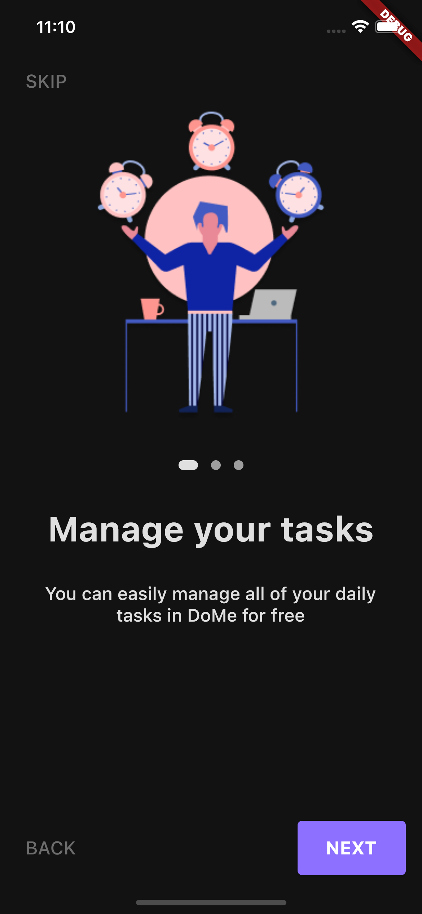

<h1>Flutter Nike Shop App</h1>

<h2>Screens: </h2>




<h2>Usage: </h2>

```bash

git clone https://github.com/universal-developer/UpTodo-app

flutter run UpTodo.app

```

<h2>Link on template: </h2>
<iframe style="border: 1px solid rgba(0, 0, 0, 0.1);" width="800" height="450" src="https://www.figma.com/embed?embed_host=share&url=https%3A%2F%2Fwww.figma.com%2Ffile%2FguMfMLpObtHXS1ktXztTMz%2FUpTodo---Todo-list-app-UI-Kit-(Community)%3Fnode-id%3D69%253A6594" allowfullscreen></iframe>
