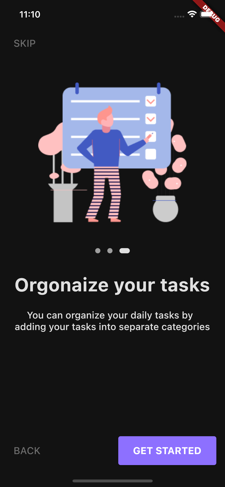

<h1>Flutter UpTodoApp</h1>

<h2>Screens: </h2>




<h2>Usage: </h2>

```bash

git clone https://github.com/universal-developer/UpTodo-app

flutter run UpTodo-app

```

<h2>Link on template: </h2>

```bash

https://www.figma.com/file/guMfMLpObtHXS1ktXztTMz/UpTodo---Todo-list-app-UI-Kit-(Community)?node-id=69%3A6594

```
